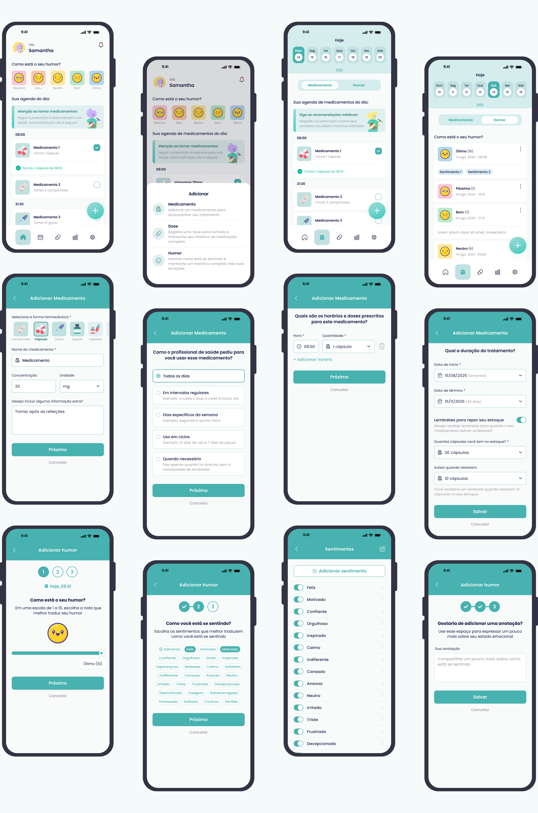

# Moodicare  
Aplicativo para apoio à adesão medicamentosa e ao monitoramento emocional!

  
**Protótipo em alta fidelidade | UX Research | Engenharia de Software | Saúde Mental**
  

---

## 📌 Sobre o projeto

O Moodicare é um aplicativo concebido para apoiar pessoas em tratamento contínuo, integrando mecanismos de **adesão medicamentosa**, **registro emocional** e **visualização de padrões terapêuticos**.  
O projeto foi desenvolvido com base em metodologias de **Design Centrado no Usuário**, **pesquisa qualitativa**, **engenharia de software** e diretrizes de **usabilidade e acessibilidade** aplicadas ao contexto da saúde mental.

A solução apresenta:

- 💊 fluxo completo de gerenciamento de medicamentos;
- 😊 registro de humor com escala numérica, sentimentos associados e anotações;
- 📅 calendário integrado com visualização cruzada (humor + doses tomadas);
- 📊 dashboard clínico para exportação de dados;
- 🎨 identidade visual construída com foco em acolhimento e clareza.

---

## 🎨 Protótipo e materiais visuais

### • Figma (projeto completo)
🔗 https://www.figma.com/design/MRRPPHEdip0zGzPPuJjJ9E/TCC?node-id=3103-53066&t=4QZSWG3xfzgCp4HW-1

### • Behance (case completo)
🔗 https://www.behance.net/gallery/234774567/pt-br-Moodicare-UXUI-Case-Study

---

## 🧭 Estrutura geral do repositório

Este repositório organiza todos os materiais produzidos ao longo do desenvolvimento do Moodicare, incluindo:

- **Pesquisa de usuários**
- **Análise comparativa (benchmark)**
- **Modelagem do usuário** (personas, jornada, mapa de empatia)
- **Engenharia de Software** (requisitos, casos de uso, banco de dados)
- **Protótipo** e documentação visual
- **Publicações e apresentações acadêmicas**

---

## 👥 Pesquisa com usuários

Foram conduzidas etapas de coleta e análise com foco na compreensão de:

- rotinas terapêuticas;
- esquecimento de medicamentos;
- variações emocionais;
- percepção de bem-estar;
- interesse e aceitação da proposta.

**Local dos arquivos:**  
👉 `pesquisa-usuarios/`  

**Artefatos derivados:**  
👉 `analise-do-usuario/`  

Incluindo:

- personas  
- mapa da empatia  
- jornada do usuário  

---

## 🔍 Análise comparativa

O benchmark incluiu:

- aplicativos de adesão medicamentosa  
- ferramentas de registro emocional  
- estudos acadêmicos correlatos  

**Local:**  
👉 `analise-comparativa/`

---

## 🛠️ Engenharia de Software

A modelagem técnica contempla:

- requisitos funcionais e não funcionais  
- diagramas UML de casos de uso  
- modelo de banco de dados  

**Local:**  
👉 `eng-software/`

---

## 🎨 Identidade Visual e UX/UI

A identidade visual foi construída com foco em:

- calor visual  
- legibilidade  
- componentes consistentes  
- sistema de cores adequado ao contexto terapêutico  

**Local:**  
👉 `prototipo/`

---

## 📄 Publicações e apresentações

O projeto foi apresentado em eventos científicos, incluindo:

- FICE  
- DiTTEt  
- Latin Science  

**Materiais completos:**  
👉 `docs/artigos/`  
👉 `docs/apresentacoes/`

---

## 👤 Autoria

**Autora:** Samantha Manuela Ferri Tavares  
**Orientação:** André Fabiano de Moraes  
**Instituição:** Instituto Federal Catarinense – Campus Camboriú  
**Contato:** samanthamanuelaferri@gmail.com

---

## 📌 Observação final

Este repositório reúne a totalidade do processo de pesquisa, design, modelagem e documentação técnica do Moodicare.  
Sinta-se livre para explorar as pastas e consultar o case completo no Behance ou no Figma.

